# Aver Engine — Rendering Architecture Design

**Target:** Unreal Engine 5 + Valve Source 2 visual quality, built exclusively on permissively-licensed technology (MIT / BSD / zlib / Apache-2.0 / public-domain). No GPL runtime, no proprietary tech (no DLSS, no UE TSR, no Simplygon, no Umbra, no Wwise).
**Backends:** Direct3D 12 (primary), Direct3D 11 (compatibility), Vulkan (scaffolded, OFF until Vulkan SDK present).
**Repo state, corrected:** this line originally said the repo was empty (git + `.gitignore` +
`.editorconfig` only) — true when §§0–3 and §§5–12 below were drafted, false since. The renderer that
actually got built diverged from this document's proposed module split: real targets are
`Aver.RHI`/`Aver.RHI.D3D12`/`Aver.RHI.D3D11`/`Aver.RHI.Vulkan` (as planned here) plus `Aver.Render.PBR`,
`Aver.Render.Voxi`(`.Renderer`), `Aver.Render.PT`, `Aver.Render.SR`, `Aver.Render.Skin` and
`Aver.Render.SoftBody` — not the `Aver.RenderGraph`/`Aver.MaterialSystem`/`Aver.Renderer.Core`
`/.Shadows`/`.GI`/`.Post`/`.Deform`/`.Geometry` split §9 proposes, none of which exist under those
names. `docs/ARCHITECTURE.md` documents the module tree as actually built; treat §9's tree as the
original design intent, not a current map. **§4b below is the one section written after the fact,
against the real, built "Voxi" renderer**, and its file/line citations describe code that exists today
— everything else in this document is the original greenfield plan and should be read that way.

This document is the rendering-layer counterpart to the existing engine recon. It inherits the world conventions established there: **left-handed, +Z up, +X forward / +Y right, centimetres, little-endian**, and the CPU/GPU **cage-deform parity contract** (`blend → mirrorY → ×Gain → clamp-to-MaxD → rest+disp`) which becomes a first-class compute feature here.

---

## 0. Design principles (what keeps us out of "Unreal-style bloat")

1. **Explicit-first RHI.** Model the abstraction on the *explicit* APIs (DX12/Vulkan). DX11 is an *emulation* target that hides beneath the same interface. You cannot bolt explicit semantics onto a DX11-shaped RHI later; you can trivially no-op explicit calls on DX11. This decision drives everything below.
2. **Pay-for-what-you-use, separately buildable modules.** Each renderer subsystem is its own CMake target with a narrow header surface. A backend you don't ship doesn't link. A feature you don't use (e.g. VSM, DDGI) is a module you don't compile. This is Hard Requirement #3 applied to rendering.
3. **The render graph is the only scheduler.** No subsystem allocates GPU memory, inserts a barrier, or submits a command list directly. Everything flows through the frame graph, which owns transient memory, barriers, queue scheduling, and pass culling. This is what prevents the "every feature touches every other feature" coupling that bloats large engines.
4. **One shader source, many targets.** HLSL is the single source of truth. DXC produces DXIL (DX12) and SPIR-V (Vulkan) from the same file; FXC (or DXC's legacy path) produces DX11 SM5.0 DXBC from a feature-gated subset. Materials are authored as graphs and *code-generated* to that one HLSL.
5. **Lean on AMD FidelityFX (MIT) and a small set of permissive libraries** rather than reinventing solved problems. The FidelityFX SDK alone (all MIT) supplies upscaling, frame generation, sharpening, AO, screen-space reflections, a software GI, a tonemapper, denoisers, and a single-pass downsampler. This is the single biggest lever for reaching UE5/Source-2 quality cheaply and legally.
6. **Honesty over marketing.** Where full parity with Nanite or Lumen is impractical for a small team, the parity matrix (§10) says so and gives the pragmatic 80% path.

---

## 1. Permissively-licensed technology map (the license backbone)

Every third-party component is chosen for a permissive license. This table is the legal spine of the whole design; nothing GPL or proprietary appears in the runtime.

| Capability | Library / technique | License | Role |
|---|---|---|---|
| Shader compile → DXIL + SPIR-V | **DirectX Shader Compiler (DXC)** | NCSA/MIT-style (LLVM) | Single front-end for both DXIL and SPIR-V |
| Shader reflection | **SPIRV-Reflect** + D3D12 reflection | Apache-2.0 / MIT | Auto root-signature / descriptor-set-layout gen |
| SPIR-V ↔ HLSL transpile (only if needed) | **SPIRV-Cross** | Apache-2.0 | DX11 SM5 fallback path; tooling |
| GPU memory allocation (DX12) | **D3D12 Memory Allocator (D3D12MA)** | MIT | Heaps for transient aliasing |
| GPU memory allocation (Vulkan) | **Vulkan Memory Allocator (VMA)** | MIT | Heaps for transient aliasing |
| Upscaling (temporal) | **AMD FidelityFX FSR 2 / FSR 3** | MIT | DLSS/TSR replacement |
| Frame generation | **FidelityFX FSR 3 Frame Interpolation** | MIT | DLSS-3 FG replacement |
| Sharpening | **FidelityFX CAS** | MIT | Post-upscale sharpen |
| Ambient occlusion | **FidelityFX CACAO** or in-house GTAO | MIT | HBAO+/UE AO replacement |
| Screen-space reflections | **FidelityFX SSSR** (stochastic) | MIT | High-quality SSR + denoise |
| Dynamic GI (software) | **FidelityFX Brixelizer GI** | MIT | Lumen-diffuse alternative (sparse SDF) |
| Tonemapping | **FidelityFX LPM** and/or **AgX** and/or **ACES** | MIT / MIT / AMPAS (permissive) | Filmic tonemap |
| Downsampling | **FidelityFX SPD** | MIT | Single-pass mip/hi-Z gen |
| GPU sort | **FidelityFX Parallel Sort** | MIT | Light lists, particles, meshlet cull |
| Mesh LOD / meshlets / simplify | **meshoptimizer** | MIT | Nanite-like cluster + LOD backbone |
| Lightmap UV atlas | **xatlas** | MIT | Static lightmap unwrap |
| CPU ray tracing (lightmap bake) | **Intel Embree** | Apache-2.0 | Offline GI/AO baker |
| Denoise (offline bakes) | **Intel Open Image Denoise (OIDN)** | Apache-2.0 | Clean baked lightmaps |
| Denoise (real-time RT) | **hand-written**, in `VoxiShaders.hpp` | — | See **[DENOISING.md](DENOISING.md)**: NVIDIA NRD was investigated 2026-08-27 and refused on licence *and* on missing inputs. FidelityFX Denoiser is MIT and blocked by the same missing inputs. **The gate on all of them is motion vectors plus a thin G-buffer**, which is the same thing FSR 2/3 and TAA are waiting behind. |
| Texture block compression | **bc7enc_rdo / bcdec** or **ISPC Texture Compressor** or **Compressonator** | MIT/PD / MIT / MIT | BC1–BC7 for `.octex` |
| Streamable/transcodable textures | **Basis Universal** | Apache-2.0 | Optional `.octex` supercompression |
| Image decode (PNG/JPEG) | **stb_image** | Public domain | Asset pipeline (embedded glTF PBR) |
| glTF parse | **cgltf** | MIT | Asset pipeline import |
| Debug/editor overlay UI | **Dear ImGui** | MIT | In-viewport debug HUD, render-graph inspector |
| Math (optional) | in-house SIMD, or **GLM** | — / MIT | Extend the existing `oc::Vec3` |

Ray tracing APIs themselves — **DXR** (Direct3D 12) and **VK_KHR_ray_tracing** (Vulkan) — are permissively-licensed parts of the platform; using hardware RT incurs no license fee. We use them where present and provide non-RT fallbacks everywhere (DX11 has no RT).

**Explicitly rejected (and their free replacement):**

| Proprietary tech | Why rejected | Free replacement |
|---|---|---|
| NVIDIA DLSS (2/3) | Proprietary SDK, hardware-locked, license terms | FSR 2/3 (MIT) |
| Intel XeSS (XMX path) | Proprietary weights on the fast path | FSR 2/3 (MIT); XeSS DP4a only if ever relicensed |
| Epic **TSR** / Nanite / Lumen (as code) | UE EULA, proprietary | In-house TAA/TAAU + FSR; meshlet GPU-driven; DDGI/Brixelizer GI |
| NVIDIA RTXGI SDK (as code) | SDK license | Implement DDGI from the *published paper*; or Brixelizer GI (MIT) |
| Simplygon (auto-LOD) | Commercial | meshoptimizer simplify (MIT) |
| Umbra (occlusion) | Commercial | GPU Hi-Z occlusion culling (in-house) |
| Wwise/FMOD | Commercial (audio, out of scope) | (engine already plans procedural audio) |

> **Patent diligence note:** algorithms (DDGI irradiance fields, VSM page tables, GTAO) are not copyrightable, so implementing them from papers avoids *licensing*. A one-time legal pass for *patent* exposure on GI techniques is prudent before shipping; DDGI-from-paper and Brixelizer-GI (MIT, AMD-authored) are the lowest-risk choices.

---

## 2. RHI abstraction

### 2.1 Layering and modules

```
RHI/                     (module: Aver.RHI — interface only, no backend code)
  RHIDevice, RHIQueue, RHICommandList, RHIBuffer, RHITexture,
  RHIPipelineState, RHIPipelineLayout, RHIDescriptorTable,
  RHIFence (timeline), RHISwapChain, RHIQueryHeap, RHISampler
RHI.D3D12/               (module: Aver.RHI.D3D12 — primary)
RHI.D3D11/               (module: Aver.RHI.D3D11 — compatibility)
RHI.Vulkan/              (module: Aver.RHI.Vulkan — built only if VULKAN_SDK found)
```

The RHI is a thin **C++ virtual interface** (or a hand-rolled vtable for hot paths) plus a **C ABI shim** (`extern "C"`) so the C# editor can create a device and drive a viewport over P/Invoke, consistent with the engine's polyglot interop backbone. Backends register themselves via a factory (`RHICreateDevice(Backend::D3D12, …)`); an unshipped backend is simply not linked. Backend selection is runtime, driven by capability probe + config, defaulting to DX12, falling back to DX11, with Vulkan gated behind SDK presence.

### 2.2 Resource model

Two resource kinds, thin over the natives:

- **RHIBuffer** — size, usage flags (`Vertex | Index | Constant | Structured | ByteAddress | Indirect | UAV | VertexUAV | CopySrc | CopyDst | AccelStructure`), memory class (`GpuOnly | Upload | Readback`). The `VertexUAV` combination is first-class because the **cage-deform output buffer is simultaneously a compute UAV and a vertex stream** (recon §7). DX12: `D3D12_RESOURCE_FLAG_ALLOW_UNORDERED_ACCESS` + used as a VB view. Vulkan: `VK_BUFFER_USAGE_STORAGE_BUFFER_BIT | VERTEX_BUFFER_BIT`. DX11: `D3D11_BIND_UNORDERED_ACCESS | D3D11_BIND_VERTEX_BUFFER` — this exact combination is legal in DX11, so **the deform path works on all three backends**.
- **RHITexture** — dimension, format (DXGI/VK enum bridged by an `RHIFormat` table), mip/array, usage (`Sampled | Storage | RenderTarget | DepthStencil | CopySrc | CopyDst`), sample count.

**Formats** are a single `enum class RHIFormat` mapped per-backend (e.g. `RGBA16_FLOAT`, `R11G11B10_FLOAT`, `RG16_SNORM`, `R32_FLOAT`, `R32_SINT`, `D32_FLOAT`, BC1–BC7, `A2B10G10R10`). The typed-buffer formats the deform shader needs (`R32_FLOAT`, `R32_SINT`) are guaranteed present on all three.

**Resource state** is explicit in the RHI (`RHIAccess`: `Common, VertexBuffer, IndexBuffer, ConstantBuffer, ShaderResource, UnorderedAccess, RenderTarget, DepthWrite, DepthRead, CopySrc, CopyDst, Present, IndirectArgument, RTAS`). On DX12 these map to `D3D12_RESOURCE_STATES` (legacy barriers) or `D3D12_BARRIER_ACCESS/LAYOUT` (Enhanced Barriers, preferred where supported). On Vulkan they map to `VkImageLayout` + access/stage masks via synchronization2. **On DX11 the RHI records state transitions but emits nothing** — DX11's driver auto-tracks hazards. The application code is identical across backends; only the backend's `Transition()` differs (real vs no-op).

### 2.3 Command lists, allocators, queues

- **Three queue types:** Graphics, Compute (async), Copy (DMA). DX12: three `ID3D12CommandQueue`. Vulkan: queue families with graceful fallback when the hardware exposes fewer. DX11: a single immediate context + deferred contexts for threaded recording (all serialized on submit — async compute becomes *inline* compute).
- **RHICommandList** wraps `ID3D12GraphicsCommandList` / `VkCommandBuffer` / `ID3D11DeviceContext(deferred)`. Allocators/pools are per-thread, per-frame-in-flight, recycled with the frame fence. Multi-threaded recording is native on DX12/Vulkan (N lists across N worker threads); on DX11 we record into deferred contexts and replay them serially — functional, slower, acceptable for a compatibility tier.
- **Submission** takes a list of command lists + wait/signal timeline values, so the frame graph controls all cross-queue ordering.

### 2.4 Pipeline state

- **RHIGraphicsPipeline** = shader stages (VS/PS, or **AS/MS mesh-shader** stages where supported), input layout, blend/raster/depth-stencil state, RT formats, sample count, pipeline layout. Compiled and cached; a persistent on-disk **PSO cache** (`ID3D12PipelineLibrary` / `VkPipelineCache` blob) keyed by a hash of the description eliminates most first-frame hitches.
- **RHIComputePipeline** = CS + layout. The cage-deform pass is a compute pipeline.
- **RHIMeshPipeline** = optional AS+MS+PS for the meshlet geometry path (DX12 Ultimate / VK_EXT_mesh_shader). Absent → the renderer falls back to indirect-draw with a classic VS.

Pipeline creation is **async** with a synchronous fast-lane: request → background compile → use last-known-good or a "loading" pipeline until ready. This is how we avoid UE's notorious PSO stutter without a proprietary precompiler.

### 2.5 Bindless / descriptor strategy (the key architectural fork)

**Tier A — Bindless (DX12 SM6.6 / Vulkan descriptor-indexing):** one large shader-visible descriptor heap (DX12 CBV/SRV/UAV heap, ~1M descriptors) or one big descriptor set with variable-count, update-after-bind arrays (Vulkan `VK_EXT_descriptor_indexing`, core 1.2). Materials index resources by a 32-bit handle stored in a per-draw/per-instance structured buffer. On DX12 we prefer **`ResourceDescriptorHeap[]` dynamic indexing (SM6.6)**; where SM6.6 is unavailable we fall back to a large unbounded descriptor table. This unlocks **GPU-driven rendering**: one indirect multi-draw over all visible meshlets, all textures/materials reachable by index, minimal CPU draw submission — the foundation for Nanite-like throughput and dense dynamic lights.

**Tier B — Bound (DX11):** DX11 has no bindless. The RHI presents the *same* handle-based API, but the DX11 backend maintains a per-draw binding cache and sets classic slot-based SRVs/samplers/CBVs (capped, e.g. 128 SRV slots) before each draw. Bindless-*dependent* features (GPU-driven meshlet culling, one-draw-all-materials) are **disabled** on DX11; it renders via a traditional per-material draw loop. This is the honest cost of the compatibility tier and is surfaced as a capability bit (`RHICaps::Bindless`).

The renderer queries `RHICaps` (`Bindless`, `MeshShaders`, `RayTracing`, `AsyncCompute`, `EnhancedBarriers`, `WaveOps`, `Typed64AtomicOps`, `SamplerFeedback`) and selects a **render path** at startup. There are effectively two paths: **"Modern"** (DX12/Vulkan bindless GPU-driven) and **"Compat"** (DX11 bound). Both share the frame graph, the material HLSL, and the lighting math — they differ only in submission strategy.

### 2.6 Synchronization

- **Timeline fences everywhere.** DX12 fences are already monotonic timelines; Vulkan uses timeline semaphores (core 1.2); DX11 uses `ID3D11Fence` (11.3+) or falls back to event queries. The RHI exposes a single `RHIFence` with `Signal(value)` / `Wait(value)` and cross-queue waits — this is how async-compute overlap and frame pacing are expressed.
- **Barriers** are inserted *only* by the frame graph (§3). DX12 → resource/UAV barriers (legacy or Enhanced). Vulkan → `vkCmdPipelineBarrier2`. DX11 → no-op (driver auto-hazard). The one place DX11 needs care is UAV→VB (deform output → draw): DX11 tracks this automatically, so it "just works," while DX12/Vulkan get an explicit `UnorderedAccess → VertexBuffer` transition emitted by the graph.
- **Frames-in-flight** = 2–3, ring-buffered upload heaps and descriptor allocators, CPU throttled on the frame fence.

### 2.7 How DX11's missing features are handled (summary)

| Explicit feature | DX12/Vulkan | DX11 handling |
|---|---|---|
| Explicit barriers | Emitted | No-op (auto-hazard tracking) |
| Bindless descriptors | Big heap / descriptor indexing | Slot-based bind cache; GPU-driven path off |
| Async compute queue | Dedicated queue + timeline sync | Inline on immediate context |
| Timeline semaphores | Native | `ID3D11Fence` or event-query fallback |
| Placed/aliased transient memory | Heaps + placed resources | Pooled resource cache (reuse, no true aliasing) |
| Multi-threaded command recording | N command lists | Deferred contexts, serial replay |
| Mesh shaders / DXR | Native (if HW supports) | Unsupported → VS indirect / no RT |
| Enhanced barriers, sampler feedback | Optional native | Unsupported (capability off) |

DX11 is positioned as a **"runs on a decade-old GPU"** compatibility tier at reduced feature level (no VSM software-page path, no GPU-driven virtualized geometry, no RT GI). It still gets clustered lighting, CSM, SSAO, SSR, TAA, FSR spatial, PBR materials, and the full cage-deform — i.e. a Source-2-ish look, not the top-tier UE5 look.

---

## 3. Render graph / frame graph

A Frostbite-style frame graph (per Yuriy O'Donnell's design) is the heart of the renderer. It is a small, standalone module (`Aver.RenderGraph`) with no backend knowledge beyond the RHI interface.

### 3.1 Model

- **Passes** declare their reads and writes of **virtual resources** (textures/buffers described, not allocated) and a lambda that records RHI commands. A pass declares a type (`Raster | Compute | Copy | RayTrace`) and an optional queue hint (`Graphics | AsyncCompute`).
- **Setup phase** (per frame, cheap): all passes register; the graph builds a DAG from resource dependencies.
- **Compile phase:**
  1. **Cull** passes whose outputs are never consumed (dead-code elimination for the frame — a debug view that isn't shown costs nothing).
  2. **Lifetime analysis**: first/last use of every transient resource.
  3. **Transient memory aliasing**: resources with disjoint lifetimes share physical memory. DX12 → D3D12MA heaps + placed resources (with aliasing barriers). Vulkan → VMA + aliased `VkImage`/`VkBuffer` bindings. DX11 → a pooled cache keyed by descriptor (reuse, since true aliasing isn't available). This is the primary VRAM saver — a 1440p HDR frame's dozens of intermediate targets collapse into a few MB of reused heap.
  4. **Automatic barrier/transition insertion** at pass boundaries from the read/write declarations — no subsystem writes a barrier by hand.
  5. **Async-compute scheduling**: passes marked async and whose dependencies allow it are moved to the compute queue and fenced against the graphics queue. Natural overlaps in our renderer: **cage-deform**, **light culling**, **SSAO/GTAO**, **Hi-Z build**, **SSR trace**, and **DDGI probe relight** run async while shadow rasterization or the previous frame's post chain occupies the graphics queue.
- **Execute phase**: record (multi-threaded on Modern path), submit with the computed fence values.

### 3.2 Import & external resources

Persistent resources (the swapchain, history buffers for TAA/DDGI, cached VSM pages, the PSO cache) are *imported* into the graph so they participate in barrier tracking without being aliased away. History buffers are double-buffered and ping-ponged across frames.

### 3.3 Example frame (abridged)

```mermaid
graph LR
  A[Upload: node disp, instance data] --> B[Cage Deform CS async]
  A --> C[Skinning / anim CS]
  B --> D[Hi-Z build async]
  C --> D
  D --> E[GPU cull: meshlets/instances]
  E --> F[Depth prepass]
  F --> G[Shadow: CSM raster + VSM pages]
  F --> H[Light cull: clustered async]
  G --> I[GBuffer / Visibility]
  H --> I
  I --> J[GTAO async]
  I --> K[DDGI probe trace+relight async]
  J --> L[Deferred lighting + clustered]
  K --> L
  L --> M[Forward+ transparency + glass]
  M --> N[SSR SSSR + volumetric fog]
  N --> O[TAA resolve]
  O --> P[FSR2/3 upscale]
  P --> Q[Bloom + tonemap LPM/AgX + CAS]
  Q --> R[UI/ImGui] --> S[Present]
```



The **cage deform is the very first GPU work of the frame** (recon: it must complete before any pass reads the deformed vertex buffer). It runs on async compute concurrently with anim/skinning and Hi-Z, then a graph-inserted `UnorderedAccess → VertexBuffer` barrier makes its output available to the depth prepass and GBuffer.

---

## 4. Lighting architecture

### 4.1 Recommendation: hybrid clustered-deferred (opaque) + clustered-forward+ (transparency)

**Recommendation:** a **clustered deferred** base for opaque geometry, with a **clustered forward+** path for transparency and glass, both sharing a single 3D **froxel cluster light-assignment structure**.

Rationale, weighed for *this* title (a destructible racing sim):

- **Deferred opaque wins** because the sim needs: dense dynamic lights (headlights, brake lights, track/pit lighting, sparks-as-lights), heavy **deferred decals** (skid marks, dirt, scorch, damage decals on crumpled panels), and screen-space effects (SSR, SSAO/GTAO, SSGI) that all read a GBuffer naturally. Source 2 ships a clustered *forward* renderer; UE5 ships deferred. For our feature mix (decals + many lights + SS effects + soft-body panels that constantly change normals), deferred is the pragmatic base and matches UE5's approach.
- **Forward+ for transparency** because deferred can't cleanly do the car glass (recall the `.ocbeam` **Glass/Shatter** material), windscreens, headlight covers, particle/volumetric transparency, and MSAA-quality edges on thin geometry. Reusing the *same* cluster light list means transparent surfaces get the same lighting model without a second light-culling pass.
- A **clustered** (froxel) light structure — rather than tiled — is chosen because froxels handle wildly varying depth (a long track receding to the horizon) without the depth-discontinuity artifacts of 2D tiled Forward+.

**Cluster grid:** e.g. 16×9×24 froxels (≈3,456 clusters) with exponential Z slicing (Tiago Sousa / Ola Olsson scheme). A compute pass builds per-cluster light lists each frame (async). Light data (position, color, radius, spot params, shadow index) lives in a bindless structured buffer.

**Visibility-buffer variant (Modern path, later phase):** for the meshlet/Nanite-like geometry path we can render a **visibility buffer** (triangle+instance IDs) instead of a fat GBuffer, then resolve material attributes in a full-screen deferred material pass. This decouples geometry cost from material cost (essential when triangle counts explode) and pairs naturally with GPU-driven meshlet rendering. GBuffer-deferred remains the baseline; the vis-buffer is an opt-in path behind `RHICaps::Bindless + MeshShaders`.

### 4.2 GBuffer layout (baseline deferred, HDR)

| RT | Format | Contents |
|---|---|---|
| GB0 | `RGBA8_SRGB` | BaseColor.rgb, AO (packed) |
| GB1 | `A2B10G10R10` | World normal (oct-encoded), packed |
| GB2 | `RGBA8` | Metallic, Roughness, Specular, ShadingModelID |
| GB3 | `RGBA8` | Motion vectors (RG) + misc (emissive mask / anisotropy) — or a dedicated `RG16_FLOAT` velocity target for TAA/FSR |
| Depth | `D32_FLOAT` | Depth (reversed-Z for precision) |
| (opt) GB4 | `R11G11B10_FLOAT` | Precomputed emissive / sky |

`ShadingModelID` selects lit-standard / clearcoat (car paint!) / cloth / glass-forward / skin, matching the PBR range UE5/Source 2 offer. Car paint (metallic base + clearcoat + flake) is a first-class shading model given the subject matter.

### 4.3 Shadows

- **Phase 1 — Cascaded Shadow Maps (CSM)** for the sun (the dominant light in an outdoor racing sim): 3–4 cascades, reversed-Z, PCF/PCSS soft edges, cascade blending, and a **cached static cascade** so the far cascade (static track geometry) isn't re-rendered every frame. Local lights use a **shadow atlas** with static/dynamic split and priority-based allocation.
- **Phase 2 — Virtual Shadow Maps (VSM)** for the high-resolution, many-light look UE5 is known for. Our VSM is a from-paper implementation (concept, not UE code): a **sparse virtual clipmap** with a page table, on-demand page allocation driven by which pages the depth buffer actually samples, **caching of static pages** (the track doesn't move; only the cars and debris invalidate pages), and page-level LOD. This is a large but tractable effort and is the single biggest "UE5 shadow parity" item. VSM requires bindless + compute → **Modern path only**; DX11 stays on CSM.
- **Contact shadows** (screen-space ray-marched short shadows) add cheap high-frequency detail on both paths — important for debris and crumpled-panel self-shadowing.

### 4.4 Global illumination (permissively-licensed) — options and recommendation

| Option | License path | Pros | Cons | Fit |
|---|---|---|---|---|
| **Baked lightmaps** (xatlas + Embree + OIDN) | Apache-2.0/MIT | Highest static quality, cheap at runtime, works on DX11 | Static only; bake time; needs UV atlas + `.oclightmap` format | **Static track geometry** |
| **DDGI** (irradiance probe volumes, from paper) | Implement from paper (patent-check) | Dynamic diffuse GI, moderate cost, RT or SDF-traced | Diffuse only; leak tuning; probe placement | **Dynamic/large-scale bounce** |
| **FidelityFX Brixelizer GI** | MIT | Turnkey MIT software GI (sparse SDF), no RT HW required | Newer, coarser than RT Lumen; integration work | **Lumen-diffuse alternative, all GPUs** |
| **SSGI** (screen-space) | In-house | Cheap contact bounce, dynamic | Screen-space only (misses off-screen) | **Contact detail layer** |
| **Voxel GI (VXGI-like)** | In-house | Fully dynamic, specular cones | Leaky, heavy, voxelization cost | Not recommended (Brixelizer supersedes) |

**Recommendation — a layered GI stack:**

1. **Baked lightmaps** for static track/environment (our own offline baker: xatlas unwrap → Embree path trace → OIDN denoise → BC6H `.oclightmap`). This alone gets Source-2-class static lighting and runs on every backend including DX11.
2. **DDGI or Brixelizer GI** for *dynamic* diffuse bounce (cars, moving objects, time-of-day changes) on the Modern path. **Recommend starting with FidelityFX Brixelizer GI** because it is MIT, ships denoisers, and needs no RT hardware — lowest license and engineering risk — then optionally add a **DXR-traced DDGI** path for hardware-RT machines to reach the top diffuse quality.
3. **SSGI** as a cheap screen-space enhancement layer on top (near-field contact GI).
4. **GTAO** (in-house, from the Activision paper) or **FidelityFX CACAO** (MIT) for ambient occlusion.
5. **Reflections:** **FidelityFX SSSR** (MIT, stochastic SSR + denoiser) as the base; **DXR ray-traced reflections** where HW RT exists (glossy car paint, glass); reflection probes / a sky cubemap as the off-screen fallback.

For a mostly-outdoor racing sim, a strong **physically-based sky/atmosphere** (Hillaire's precomputed scattering, published/free) + baked static GI + Brixelizer/DDGI dynamic bounce + SSGI + GTAO + SSSR gives a look competitive with UE5 outdoor scenes without any proprietary tech.

### 4.5 Volumetrics

Froxel-based **volumetric fog** (Bart Wronski's approach, published): scatter/extinction into a 3D froxel volume, temporally integrated, ray-marched and applied. Reuses the cluster structure. Handles track-side atmosphere, exhaust haze, tyre smoke light interaction, and god-rays from sun/headlights. God-rays also available as cheaper screen-space radial blur on Compat.

---

## 4b. Path tracer scene view (reference renderer)

**Available as:** the `--pt-scene` command-line flag at startup, OR the editor's own **Project Settings > Rendering > Path Tracing > Quality** control (any value but Off) at any later frame — both requests funnel through the same `SandboxApp::syncPtSceneView` reconciler, so a live editor session can turn this on and off without a relaunch. Opt-in; disabled by default either way.

### 4b.1 What it is

`PtSceneView` is a **reference still-camera renderer** that points the existing brute-force path tracer at the REAL scene graph — the same geometry and camera the raster pipeline is already drawing. Unlike `PtFurnaceTest`, which brings its own synthetic test geometry to verify the integrator's math in isolation, this captures the scene through the `rhi::IRenderFeature::submitDraw()` hook (the exact interface `VoxiRenderer` uses for draw-list recording) and the real camera via `rhi::IDevice::camera()`, then accumulates a bounded number of samples each frame toward a physically-based ground truth.

It **suppresses the raster scene** while registered and draws its own accumulator instead — **corrected: no longer one fixed resolution.** This used to be a single 480×270 target; `PtSceneView::setQuality(u32 rung)` now selects among a four-rung ladder (see 4b.3), still independent of the editor viewport's own size. It is only registered when explicitly requested — `--pt-scene` at startup, or the editor's own settings-page control at runtime (see 4b.6) — never by default; when unregistered it costs nothing, exactly like the furnace test. **This is a reference tool for validating the raster renderer's output, not a render mode.**

### 4b.2 How it works

1. **Scene capture (per frame):** Each `submitDraw()` call appends to a draw list. At the start of the next frame, the *previous* frame's list is frozen (to ensure it is complete before the path tracer reads it), and a fresh list begins accumulating the new frame's draws.
2. **Static filter:** Only meshes with *no* compute-written vertex buffer are included. This excludes skinned characters, particles, and any per-frame vertex pass, because including dynamic geometry would cause the accumulator to reset every frame and never progress past sample 0 (the scene "changes" every frame).
3. **Scene rebuild:** Every still frame, the draw list is hashed (FNV-1a, bit-exact over floats, the same scheme `VoxiRenderer::giDrawsKey()` uses). If the hash changes or the scene was never built, the path tracer rebuilds its acceleration structures from the static draw list and resets the sample count to 0.
4. **Camera stability:** If the camera moves (detected by sampling `IDevice::camera()` each frame and comparing inverse-viewproj + eye position), the accumulator resets. The camera derives an internal `PtCamera` with the **accumulator's own fixed 16∶9 aspect ratio, never the real viewport's** — a small reference target is not obliged to match whatever ratio the editor's dockspace happens to be, which changes size far more often than levels do.
5. **Bounded accumulation:** Once per stable camera pose, up to 8 samples are accumulated per frame (total ~40 RayQuery traces per pixel — ~5.2M traces/dispatch at the Low rung's 480×270, more at Medium/High/Epic, see 4b.3 — same order of magnitude as `VoxiRenderer`'s own ray-traced sun shadow, and unlike that shadow, **this dispatch is NOT issued every frame once the image converges** — it stops at 1,600 samples/pixel and does not resume until the camera moves again).

### 4b.3 What it deliberately does NOT do (stated here so the first user does not file a bug)

**LIGHT SOURCE:** `ptEnvironment()` is `skyColor()` only — no `CLight`, no emissive term, no next-event estimation. **This view is only physically meaningful for scenes lit by the procedural sky: outdoor levels or interiors that see sky through real openings.** Pointed at an indoor/artificially-lit level, it will correctly, honestly render BLACK. That is not a bug; that is a feature limitation.

**GEOMETRY:** Includes only static draws (no compute-written vertex buffers, per line 132 of PtSceneView.cpp, drifted from 129 — the same predicate `IDevice::meshVertexBuffer()` applies). Skinned characters, particles, and anything else that writes its own vertices every frame are silently absent.

**MATERIALS:** Each surface resolves to one flat linear albedo (either from the host's `AlbedoResolver` callback, if installed, or the legacy per-draw base colour otherwise). No textures are sampled, no metallic/roughness (the integrator is pure Lambertian), no emissive term — a textured material renders as its flat, decoded base colour.

**PERFORMANCE:** No denoiser, no importance sampling of lights, no spectral anything. It is a progressive, still-camera-only reference accumulator within bounded GPU cost. **Corrected:** the resolution is no longer one hardcoded constant — see `PtSceneView.hpp:277-325` (drifted from `151-175`) for `kMaxBounces=4`, `kSamplesPerStep=8`, `kMaxSamples=1600`, and the four-rung `kAccumLadder` a Path Tracing quality combo of Low/Medium/High/Epic now selects between (480×270 / 640×360 / 960×540 / 1280×720 — `PtSceneView::setQuality(u32 rung)`, `PtSceneView.cpp:517`). Measured cost against a 9.5 ms raster frame on the same scene: Low 4.5 ms, Medium 5.0 ms, High 5.5 ms, Epic 6.9 ms — every rung cheaper than the raster view it suppresses, not linear in pixel count (7.1x the pixels for 1.5x the frame time), because the tier spends on resolution rather than samples: while the camera moves the accumulator restarts every frame regardless of rung, so a bigger rung means less viewport magnification of the same one-step image, not more samples.

### 4b.4 Host integration: the AlbedoResolver seam

The `PtSceneView::AlbedoResolver` is a `std::function<bool(BindingSetHandle, const void* constants, u32 bytes, f32 outAlbedo[3])>` callback the composition root installs to resolve a draw's material binding to a flat linear albedo. **THE HOST RESOLVES, NOT THIS MODULE** — the same division `LandscapeRenderer::setSurfaceBinding()` already uses, because `submitDraw()` is handed a binding handle and raw bytes with no type attached, and only the composition root knows what bound them (PtSceneView.hpp, lines 89–91, drifted from 61–67). This module links `Aver.RHI` and `Aver.Core` only (no PBR material system), so it cannot name a `pbr::` type to check against even if it wanted to. Guessing from the bytes' size instead — "it is a material if the block is the right SIZE" — would silently pass any unrelated block of the same size (only the *symptom* would be a wrong colour, no build error). Left unset, every draw uses its base colour, which is correct for hosts with no material system at all (the furnace test brings its own geometry and never sets one).

### 4b.5 RHI change: acceleration structures no longer require a window

**Prerequisite for headless path-tracer runs:** `D3D12Device::initAccelerationStructures()` was moved from `createSwapchainResources()` to `init()` (commit 43fab37; the call now sits at `D3D12Device.cpp:2102`, drifted from the `1927` first recorded here as the file grew — the function itself is defined at `:2588`). This means DXR 1.1 capability detection and the ray-tracing device (`device5_`) are initialized before any window exists. Previously, headless runs had `device5_ == nullptr` despite RT tier 11 capabilities, silently disabling path tracing. This applies to DX12 only; Vulkan and DX11 have no ray-tracing backend changes (Vulkan already builds structures headless; DX11 has no RT).

### 4b.6 Runtime toggle: no relaunch required

`PtSceneView` used to be constructed and registered exactly once, at Engine startup, only when `--pt-scene` was passed — there was no way to turn it on, see it, or turn it off without relaunching the whole editor. `SandboxApp::syncPtSceneView(IDevice*)` closes that gap: it reconciles `ptSceneView_` (the ACTUAL registration, `nullptr` or not) against `ptSceneViewWantEnabled_` (the REQUESTED state — set once by `--pt-scene` at startup, and from then on by the **Project Settings > Rendering > Path Tracing > Quality** combo on the same page as every other Voxi feature: any value but Off requests the view on, Off requests it off — and, since the accumulation ladder landed (4b.3), the combo's specific value also drives setQuality()'s rung, not just on/off). It is idempotent (a call that finds the two already agreeing does nothing) and is called from `onUpdate()` only — before `IDevice::beginFrame()`, the one point in the frame loop where nothing is mid-recording, since `suppressesScene()` is read live once per `drawMesh()` call all through `onRender()`. `addRenderFeature()`/`removeRenderFeature()` (both pre-existing `IDevice` operations) do the actual RHI work: registering mid-session builds the present pipeline against the swapchain's current render targets for free (`addRenderFeature` calls `onRenderTargetsChanged()` immediately), and unregistering is a plain vector erase with every owned GPU resource released through the resource factory's normal deferred-retire path, safe even with frames still in flight.

The editor surfaces convergence for the first time too: `PtSceneView::samplesAccumulated()`/`sceneReady()` are read on that same settings page, next to an `[active]` / `[unavailable on this device]` badge.

One accepted, pre-existing gap this makes more visible rather than introduces: the RHI has no `destroyTlas` at all (`IResourceFactory`), so every TLAS a `PathTracer` builds leaks for the life of the device. Toggling this view on and off in one long editor session leaks one TLAS per genuine re-arm of the static scene — bounded by how often the scene actually changes while the view is on, not by how many times the checkbox is clicked. `PathTracer::shutdown()`'s BLAS leak (a real, separate bug: `destroyBlas` exists and was simply never called there) was fixed alongside this change, since a toggle can now call `shutdown()` many times in one process instead of once at exit.

---

## 5. Material / shader system

### 5.1 Authoring model

- **Node-based material graph** authored in the **C# editor** (.NET 10), producing a `.ocmat` asset (the new native material format from the assets recon). The graph is a DAG of typed nodes (texture sample, math, PBR output, car-paint clearcoat, deform-aware nodes) → **code-generated to HLSL**. This mirrors UE's material editor and Source 2's `.vmat` conceptually, but the *runtime* consumes compiled shader variants, not the graph.
- **HLSL is the single source of truth.** Hand-written shaders and graph-generated shaders both go through the same compile pipeline. Common lighting/BRDF/PBR code lives in shared `.hlsli` includes; the material graph fills in a `EvaluateMaterial()` function that the uber-shader calls.
- **Material domains / shading models:** Standard (metal-rough PBR), ClearCoat (car paint), Glass/Transparent (forward+), Cloth, Skin, Unlit, Decal, Foliage/Two-sided. This matches the PBR breadth of UE5/Source 2. The glTF metallic-roughness import (BaseColor×factor, MR texture B/G, normal, emissive, alpha mode — recon `assets`/`arch`) maps 1:1 onto the Standard model, so existing OpenConstructor bodies import faithfully.

### 5.2 Cross-compilation (one source → three targets)

```
material graph ──codegen──▶  HLSL (SM6.x)  ──DXC──▶ DXIL   (D3D12)
hand-written HLSL      ────────────────────┴─DXC──▶ SPIR-V (Vulkan)
                                            └─FXC/DXC-legacy──▶ DXBC SM5.0 (D3D11)
```

- **DXC** (permissively-licensed, LLVM/NCSA) is the primary compiler: it emits **DXIL** for DX12 and **SPIR-V** for Vulkan from the *same* HLSL source (SM6.0+). This is the modern, supported, free path — no SPIRV-Cross needed for the forward direction.
- **DX11** needs DXBC (SM5.0). Options: (a) compile the same HLSL with **FXC** (or DXC's legacy DXBC path) restricted to an SM5-compatible subset, feature-gating bindless/wave-ops/SM6 constructs behind `#if AVER_BINDLESS` macros; or (b) DXC→SPIR-V→**SPIRV-Cross**→HLSL SM5→FXC for shaders that are hard to keep dual-source. Path (a) is default (simpler, faster); path (b) is the escape hatch. The material codegen emits both a "modern" and a "compat" entry variant.
- **Reflection** via D3D12 shader reflection (DXIL) and **SPIRV-Reflect** (SPIR-V) auto-generates the **RHIPipelineLayout** (root signature / descriptor set layout), so binding declarations are never hand-maintained and can't drift between backends. This directly solves the recon's observation that `VehicleDeform.usf` relied on UE's auto-reflection — we replicate that convenience portably.

### 5.3 Permutation / variant management

The classic combinatorial-explosion problem, handled with a hybrid strategy (UE "static switches" meet Source 2 "combos"):

- **Static permutations** only for coarse, must-be-compile-time features: shading model, MSAA on/off, shadow technique (CSM/VSM), backend feature level, deform on/off. Kept to a small factorable set.
- **Dynamic uniform branching** for everything fine-grained (light count, feature toggles, quality tiers) — cheap on modern GPUs and drastically shrinks the variant count vs. UE's historical explosion.
- **Variant keys** are hashed; an **offline shader database** (built by the Rust asset-pipeline tool over the C ABI) precompiles the shipping permutation set. At runtime, unknown variants compile **async** with the PSO cache warming from disk, so first-encounter hitches are rare and never block the frame.
- **PSO/pipeline cache** persisted per-driver-version, keyed by device, invalidated on driver change.

The offline permutation compile lives in the **Rust tooling** module (asset pipeline), invoking DXC over the C ABI — consistent with the engine's language split (Rust = tooling/asset pipeline).

---

## 6. Post-processing / AA / upscaling

All permissively-licensed; each proprietary feature has a named MIT/permissive replacement.

| Stage | Technique | License | Replaces |
|---|---|---|---|
| Temporal AA | In-house **TAA** (neighborhood clamp, YCoCg, motion-vector reprojection) | in-house | UE TAA |
| Temporal upscaling | **FidelityFX FSR 2 / FSR 3** (TAAU-class) | MIT | DLSS, XeSS-XMX, UE TSR |
| Frame generation | **FidelityFX FSR 3 Frame Interpolation** (optional) | MIT | DLSS 3 FG |
| Sharpening | **FidelityFX CAS** | MIT | NIS sharpen |
| Ambient occlusion | **GTAO** (in-house) or **FidelityFX CACAO** | in-house/MIT | HBAO+, UE AO |
| Screen-space reflections | **FidelityFX SSSR** | MIT | UE SSR |
| Tonemapping | **FidelityFX LPM**, **AgX**, or **ACES** | MIT / MIT / AMPAS | UE ACES tonemapper |
| Bloom | Dual-filter / Kawase down-up pyramid (in-house, uses **SPD**) | in-house/MIT | UE bloom |
| Motion blur | Per-object + camera velocity gather (in-house) | in-house | UE motion blur |
| Depth of field | Bokeh gather (in-house) or **FidelityFX DoF** | in-house/MIT | UE DoF |
| Auto-exposure | Histogram compute (in-house, uses SPD) | in-house | UE eye adaptation |
| Color grading | 3D LUT + curves | in-house | Standard |
| Lens/vignette/grain/CA | In-house post | in-house | Standard |

**AA/upscaling recommendation:** ship **TAA** as the base resolve, then **FSR 2** as the default temporal upscaler (best quality/compat balance, MIT, works on any DX12/Vulkan GPU and even DX11 with the spatial FSR 1 fallback), **FSR 3** where available, and **FSR 3 Frame Gen** as an optional toggle. This gives DLSS/TSR-class results with zero licensing exposure. FSR 2/3 want motion vectors + depth + a jittered render — already produced by the GBuffer/TAA pipeline, so integration is a resolve-stage swap.

DX11 (Compat) gets TAA + **FSR 1 (spatial)** + CAS — no temporal upscaling (FSR2/3 need compute features that are marginal on old DX11 HW), no frame gen. Honest tier reduction.

---

## 7. GPU cage-deform compute — first-class integration

The GPU vehicle-body deform (recon `gpudeform`) is promoted from a plugin feature to a **core render-graph compute stage**, because destructible soft-body panels are the entire point of the sim.

### 7.1 Where it lives

`Aver.Renderer/Deform` — a compute pass registered into the frame graph as the **first GPU work each frame** (before depth prepass), on the **async compute queue** where available. It consumes the physics solver's per-node displacement field and writes deformed vertex positions into a UAV buffer that is *also* the mesh's position vertex stream.

### 7.2 Buffer contract → RHI mapping (faithful to recon)

| Recon buffer | RHI resource | Format | Lifetime |
|---|---|---|---|
| `RestPositions` | RHIBuffer(ShaderResource) | `R32_FLOAT`, `NumVerts*3` | static per section |
| `BindNodeIdx` | RHIBuffer(ShaderResource) | `R32_SINT`, `NumVerts*K` | static; re-upload on tear |
| `BindNodeWt` | RHIBuffer(ShaderResource) | `R32_FLOAT`, `NumVerts*K` | static; re-upload on tear/retear |
| `NodeDisp` | RHIBuffer(ShaderResource) | `R32_FLOAT`, `NumNodes*3` | **recreated every frame**, shared by all sections of a cage |
| `OutPositions` | RHIBuffer(**UAV \| Vertex**) | `R32_FLOAT`, `NumVerts*3` | static; written every dispatch; bound as VB slot 0 |
| scalars (`NumVerts, NumNodes, K, bMirrorY, Gain, MaxD, …`) | RHI constant buffer (`b0`) | — | per dispatch |

The `.usf` is ported to plain HLSL for DXC per recon §13: drop the UE `Platform.ush`, wrap the loose globals in `cbuffer Params : register(b0)`, add explicit `register(t0..t3)`/`register(u0)` bindings (or use bindless handles on the Modern path). The **math is preserved byte-for-byte** — `blend → mirrorY → ×Gain → clamp-to-MaxD → rest+disp`, weights pre-normalized (sum, never re-divide), skip `ni<0 || ni>=NumNodes` — to keep the CPU `DeformedVert` parity contract that the physics/networking layers depend on (crash dents must reproduce identically across peers).

### 7.3 Dispatch & barriers (graph-managed)

- Per frame: gather `Position - LocalRest` per node (from the solver, cage space, cm) → flatten to `float[NumNodes*3]` → upload → **recreate** the `NodeDisp` buffer (deliberately not lock-rename; the graph handles the SRV lifetime) → for each visible, bound, non-empty, **non-skinned** section, dispatch `ceil(NumVerts/64)` groups of `[numthreads(64,1,1)]`.
- The graph inserts `UnorderedAccess → (VertexBuffer | ShaderResource)` around each dispatch (DX12/Vulkan). On DX11 this is a no-op (auto-hazard) but the same code runs.
- The output buffer is created in the dual read state (`VertexBuffer | ShaderResource`) so the first pre-dispatch transition's old-state matches, and is bound as the **position vertex stream** (`VET_Float3`, stride 12, offset 0) for every raster pass (depth, GBuffer, shadow, velocity), with the SRV also set for manual-vertex-fetch / RT paths.

### 7.4 Cross-backend

- **DX12/Vulkan (Modern):** full path, async compute, bindless handles, GPU-driven so all sections dispatch from one command list.
- **DX11 (Compat):** the exact combination `BIND_UNORDERED_ACCESS | BIND_VERTEX_BUFFER` is legal, and CS 5.0 covers the shader — so **the deform runs on DX11 too**, inline on the immediate context (no async), one dispatch per section. This is a genuine advantage: destructible bodies work on the compatibility tier.

### 7.5 Scope & fallback

The GPU path implements only the **cage-crumple blend** (per recon). Sections that additionally need articulated **linear-blend bone skinning** (rig/anim) compose that on top via a **separate skinning compute pass** feeding the same output buffer, or fall back to the **CPU procedural-mesh renderer** (parity path) when skinning + deform must combine — exactly as the recon's eligibility gate specifies (`DriveMode==GpuCompute && bRenderBody && SM5+ && ≥1 non-broken, non-skinned section`). **Tear/hide** are cheap in-place buffer swaps (swap the section index buffer + re-upload the renormalized weight SRV), not full rebuilds.

---

## 8. Nanite-like virtualized geometry (the hard one, done honestly)

Full Nanite parity (billions of source triangles, seamless micropoly LOD, software rasterizer for sub-pixel triangles, automatic streaming) is a multi-year research effort and is **Partial parity** for a small team. The pragmatic 80% path:

- **Meshlet clustering** with **meshoptimizer** (MIT): build meshlets (~64–124 tris), a **cluster LOD hierarchy** (DAG of simplified cluster groups via `meshopt_simplify`), and per-meshlet bounds/normal cones.
- **GPU-driven rendering** (Modern path only): frustum + Hi-Z occlusion + backface-cone cull per meshlet in compute → indirect draw. **Mesh shaders** (AS/MS) where supported; indirect VS fallback otherwise.
- **Runtime LOD selection** per cluster by screen-space error (choose the coarsest cluster group whose projected error < 1px) — this is the core of Nanite's "just works" LOD without discrete LOD pops.
- **Streaming:** page cluster data from disk on demand (our `.ocmesh` format stores the cluster hierarchy + a page index). This gets us continuous LOD and huge instance counts.
- **What we deliberately skip:** the software rasterizer for tiny triangles (we clamp minimum cluster LOD to keep triangles ≥ a few pixels) and truly unbounded source density. Result: **High** parity for dense static environments and kit-bashed track detail, **not** literal micropoly. This is an honest, shippable subset.

DX11 (Compat) uses **classic discrete LODs** (also generated by meshoptimizer) — no virtualized geometry.

---

## 9. Module structure & build (Hard Requirement #3)

Rendering is a set of independently buildable CMake targets with narrow interfaces, so the engine avoids Unreal-style monolith bloat:

```
Aver.RHI            (interface + RHIFormat + caps)         — depends: Core, Platform
Aver.RHI.D3D12                                             — depends: RHI, d3d12, D3D12MA
Aver.RHI.D3D11                                             — depends: RHI, d3d11
Aver.RHI.Vulkan     (compiled only if VULKAN_SDK found)    — depends: RHI, vulkan, VMA
Aver.RenderGraph    (frame graph, aliasing, scheduling)    — depends: RHI
Aver.ShaderSystem   (DXC/FXC wrap, reflection, cache)      — depends: RHI, DXC, SPIRV-Reflect
Aver.MaterialSystem (graph → HLSL codegen, .ocmat)         — depends: ShaderSystem
Aver.Renderer.Core  (view/scene, GBuffer, clustered light) — depends: RenderGraph, MaterialSystem
Aver.Renderer.Shadows  (CSM; VSM optional module)          — depends: Renderer.Core
Aver.Renderer.GI       (baked LM; DDGI/Brixelizer optional)— depends: Renderer.Core
Aver.Renderer.Post     (TAA, FSR, bloom, tonemap)          — depends: Renderer.Core, FidelityFX
Aver.Renderer.Deform   (cage deform + skinning compute)    — depends: Renderer.Core, physics interop
Aver.Renderer.Geometry (meshlet GPU-driven; Modern only)   — depends: Renderer.Core, meshoptimizer
Aver.Render.PathTracer (brute-force reference tracer, PtSceneView scene capture) — depends: RHI, Core
Aver.Tools.ShaderCompiler (Rust, offline permutations)     — over C ABI → ShaderSystem
Aver.Tools.LightmapBaker   (Rust/C++, offline)             — Embree, OIDN, xatlas
```

Each optional module (VSM, DDGI, meshlet geometry) is a plugin that registers into the frame graph; not linking it removes the feature and its cost entirely — literal pay-for-what-you-use. A **C ABI** (`extern "C"`) over `Aver.RHI` + `Aver.Renderer.Core` lets the C# editor create devices, drive viewports, and inspect the render graph; the Rust asset pipeline drives offline shader/lightmap bakes over the same ABI. This is consistent with the engine's polyglot backbone (C++ core, C ABI, C# editor, Rust tooling).

---

## 10. Feature parity matrix (honest)

Parity legend: **Full** = matches UE5/Source 2; **High** = ~90%, minor gaps; **Partial** = usable subset, visible gaps; **Limited** = present but clearly behind. Effort: S (weeks), M (1–3 mo), L (3–6 mo), XL (6–12+ mo), per capability, small team.

| UE5 / Source 2 capability | Aver approach (permissively-licensed) | Backends | Parity | Effort | Notes / honest gaps |
|---|---|---|---|---|---|
| **Nanite** (virtualized geometry) | meshoptimizer meshlets + cluster-LOD DAG + GPU-driven (mesh shaders) + streaming | DX12/VK | **Partial→High** | XL | No software micro-tri rasterizer; clamp min LOD; not unbounded density. Compat: discrete LODs. |
| **Lumen** (dynamic GI) | Brixelizer GI (MIT) and/or DDGI (from paper) + SSGI + baked LM | DX12/VK (bake: all) | **Partial→High** | L–XL | Diffuse strong; full detailed specular GI is the gap. DX11: baked only. |
| **Virtual Shadow Maps** | From-paper sparse VSM (page table, static caching) | DX12/VK | **High** | L | Big but tractable. DX11: CSM only. |
| Cascaded shadow maps | In-house CSM + PCSS + static cache | all | **Full** | M | — |
| Ray-traced reflections | DXR/VK_KHR RT (permissively-licensed API) + SSSR fallback | DX12/VK (RT HW) | **High** | M | SSSR (MIT) everywhere; RT where HW present. DX11: SSR-lite. |
| Screen-space reflections | FidelityFX SSSR (MIT) | all | **Full** | S | Turnkey MIT. |
| **PBR materials** (metal-rough, clearcoat, cloth, skin) | Material graph → HLSL uber-shader, multiple shading models | all | **Full** | M | Car-paint clearcoat is first-class. |
| Material graph editor | C# node editor → HLSL codegen | all | **High** | L | Runtime consumes compiled variants. |
| Deferred decals | GBuffer decal pass, clustered | all | **Full** | S | Skid/dirt/damage decals. |
| Volumetric fog / lighting | Froxel scatter (Wronski, published) | all | **High** | M | Reuses clusters. DX11: cheaper. |
| Temporal upscaling (DLSS/TSR) | **FSR 2/3 (MIT)** + in-house TAA | DX12/VK | **Full** | S | Zero license risk. DX11: FSR 1 spatial. |
| Frame generation (DLSS3) | **FSR 3 FG (MIT)** | DX12/VK | **High** | M | Optional. |
| TAA | In-house | all | **Full** | S | — |
| Ambient occlusion | GTAO / FidelityFX CACAO (MIT) | all | **Full** | S | — |
| Tonemap / color pipeline | LPM / AgX / ACES + LUT grading | all | **Full** | S | — |
| Bloom / DoF / motion blur / exposure | In-house + SPD (MIT) | all | **Full** | S–M | — |
| Sky / atmosphere | Precomputed scattering (Hillaire, published) | all | **High** | M | Key for outdoor racing look. |
| **Soft-body destructible body deform** | GPU cage-deform compute (recon) — first-class | **all incl. DX11** | **Full** | S | Our signature feature; parity-locked to CPU path. |
| Skeletal/anim skinning | Compute LBS feeding same VB | all | **High** | M | Composes with deform per eligibility gate. |
| GPU-driven rendering | Bindless + indirect multi-draw | DX12/VK | **Full** | M | DX11: bound path, off. |
| Bindless resources | SM6.6 heap / VK descriptor indexing | DX12/VK | **Full** | M | DX11: slot-based cache (feature off). |
| Async compute | Dedicated queue + timeline sync | DX12/VK | **Full** | M | DX11: inline. |
| Transient memory aliasing | D3D12MA / VMA placed+aliased | DX12/VK | **Full** | M | DX11: pooled reuse (no true alias). |
| Hardware ray tracing | DXR / VK_KHR (permissively-licensed) | DX12/VK+HW | **Full (API)** | M | Used for RT reflections/GI where present. |
| Cesium-style georef terrain streaming | *Deferred* — dormant in source; plan our own tiled streaming | — | **Not yet** | XL | Recon flags Cesium as staged/unwired; treat as future module, not a dependency. |

**Where full parity is impractical (stated plainly):** *Nanite's* software micro-triangle rasterizer and truly unbounded geometry, and *Lumen's* full detailed specular software tracing, are the two features where a small team should target a strong subset rather than 1:1 parity. The meshlet+LOD path and Brixelizer/DDGI+SSGI+baked stack get visually close for this title's outdoor, vehicle-centric content, and both degrade gracefully to the DX11 compatibility tier. Everything else in the matrix is Full or High with permissive tech.

---

## 11. Phasing / roadmap

1. **P0 — RHI + frame graph skeleton (DX12 first).** Device/queues/timeline fences, buffers/textures, PSO, one triangle, frame graph with transient aliasing and auto-barriers. DXC → DXIL. Bindless heap. *Exit:* a clustered-forward triangle scene at HDR with TAA.
2. **P1 — Deferred base + clustered lights + CSM + PBR materials + material codegen.** GBuffer, clustered light cull, CSM shadows, glTF PBR import path, FSR 2 upscale, LPM tonemap. *Exit:* an OpenConstructor car rendered with real materials and shadows.
3. **P2 — Cage-deform compute as first-class + skinning.** Port `VehicleDeform.usf` to DXC HLSL, wire into the graph, verify byte-for-byte CPU parity. *Exit:* live destructible body on DX12.
4. **P3 — GI + reflections + volumetrics.** Baked lightmap toolchain (Embree/OIDN/xatlas → `.oclightmap`), SSSR, SSGI, GTAO, sky/atmosphere, froxel fog. *Exit:* full outdoor lighting.
5. **P4 — DX11 compat backend.** Same interfaces, emulated explicit features, deform via UAV|VB, CSM, FSR 1. *Exit:* runs on old hardware at reduced tier.
6. **P5 — Modern high-end.** VSM, Brixelizer GI / DXR DDGI, meshlet GPU-driven geometry, FSR 3 + frame gen.
7. **P6 — Vulkan backend** (once Vulkan SDK installed): DXC → SPIR-V (already produced), VMA aliasing, descriptor indexing, timeline semaphores. Mostly a backend fill-in since the RHI was designed explicit-first.

---

## 12. Risks & honest limitations

- **VSM and meshlet-virtualized geometry are the two largest, highest-risk items** and are correctly gated to the Modern path; the engine is fully functional and good-looking without them (CSM + discrete LODs). Sequence them last.
- **DX11 is a genuine feature reduction**, not a full port: no VSM, no GPU-driven/bindless, no RT, no temporal upscaling, baked-only GI. This is by design (explicit-first RHI) and should be communicated as a "compatibility tier," not "the same engine minus a few effects."
- **GI patent diligence** (DDGI especially) needs a one-time legal review before ship; Brixelizer GI (MIT, AMD-authored) is the lowest-risk primary and is the recommended default to reduce that exposure.
- **The deform parity contract is load-bearing across subsystems** (physics + networking replay crash seeds through identical CPU/GPU math). Any change to the deform shader must be validated against the CPU reference or it silently breaks multiplayer dent reproduction. Treat the parity test as a CI gate.
- **FSR temporal upscalers need clean motion vectors** for *deforming* bodies — the cage-deform stage must write per-vertex motion (previous vs current deformed position) into the velocity target, or crashed panels will ghost. This is an explicit integration task in P2, not an afterthought.
- **Cesium/georef terrain** is dormant in the source; do not adopt it as a dependency. If real-world track streaming is needed, design an in-house tiled terrain streamer (its own future module) rather than pulling a heavy external plugin.

---

### Key references
- Cage-deform integration source of truth: `Plugins/OCShaders/Shaders/Private/VehicleDeform.usf`, `GpuVehicleCageComponent.cpp`, CPU parity `VehicleCageComponent.cpp:1215-1261` (see recon `gpudeform`).
- World conventions (LH, +Z up, cm, mirror-Y, parity contract): recon `arch` §1, §6.
- Target engine root (greenfield): `C:/Users/User/Documents/Aver Engine`.
- Proposed module tree, license map, and parity matrix: this document, §1, §9, §10.